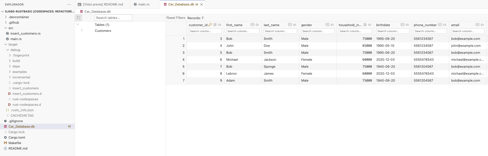
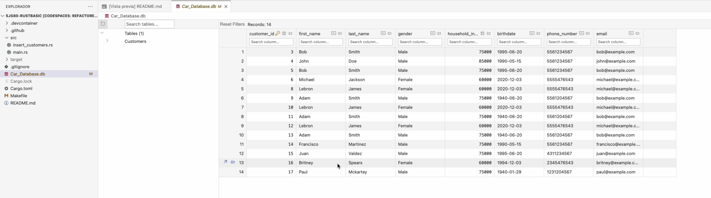
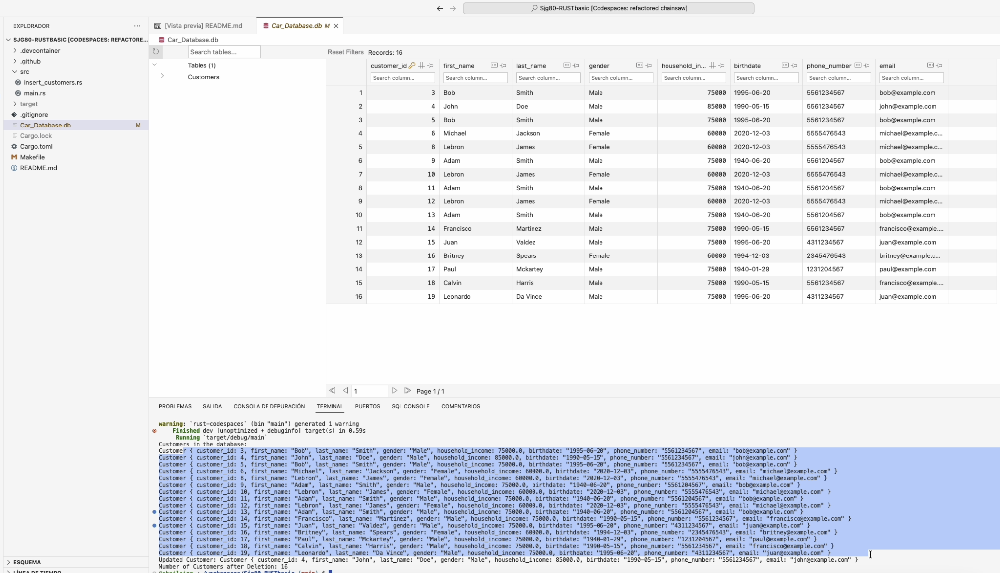

# Sjg80-Rust CLI Binary with SQLite

[](https://github.com/nogibjj/Sjg80-RUSTbasic/actions/workflows/rust.yml)
[](https://github.com/nogibjj/Sjg80-RUSTbasic/actions/workflows/rust.yml)
[](https://github.com/nogibjj/Sjg80-Rust-CLI-Binary-with-SQLite/actions/workflows/rust.yml)
[](https://github.com/nogibjj/Sjg80-Rust-CLI-Binary-with-SQLite/actions/workflows/rust.yml)

# Rust CLI Binary with SQLite

This Rust project showcases a Command-Line Interface (CLI) binary that interacts with an SQLite database, allowing you to perform CRUD (Create, Read, Update, Delete) operations on a "Customers" table.

## Introduction

This Rust CLI binary is designed to work with an SQLite database that contains a "Customers" table. You can create, read, update, and delete customer records through the CLI. The project leverages the `rusqlite` crate for database interaction.

## Usage

Follow the steps below to set up and use this Rust CLI binary:

### Prerequisites

- Rust programming environment: Make sure you have Rust installed on your system.

### Dependencies

This project uses the following dependencies:

- `rusqlite`: For SQLite database interaction.
- `csv`: To work with CSV files.
- `reqwest`: To make HTTP requests.
- `assert_cmd`: For testing command-line applications.
- `predicates`: For testing command-line output.
- `libc`: For C standard library bindings.
- `rust-bert`: For natural language processing (NLP).

To install the Rust dependencies, add them to your `Cargo.toml` file and run `cargo build`.

### Building the Binary

To build the Rust binary, use the following command:

bash
cargo build --release

## Rust CLI Binary with SQLite

This project demonstrates how to create a Rust CLI binary with a SQLite database. The binary can be used to perform CRUD operations on the database.

## How to use GitHub Copilot

GitHub Copilot is a tool that can be used to generate Rust code. To use GitHub Copilot in this project, I installed the GitHub Copilot extension for Visual Studio Code. Once the extension was installed, I could generate Rust code by typing `// <tab>`.

## SQLite Database

The SQLite database is a lightweight database that can be used to store data. To use the SQLite database in this project, I installed the `rusqlite` crate. The `rusqlite` crate provides a Rust interface to the SQLite database.

## CRUD Operations

The following CRUD operations are demonstrated in this project:

* **Create:** The `main()` function creates a new customer in the database.
* **Read:** The `main()` function reads all customers from the database.
* **Update:** The `main()` function updates the household income of a customer in the database.
* **Delete:** The `main()` function deletes a customer from the database.

## Optimized Rust Binary

The following process is used to generate an optimized Rust binary:

1. The `cargo build --release` command is used to build the Rust binary in release mode.
2. The `strip` command is used to remove unnecessary symbols from the Rust binary.
3. The `upx` command is used to compress the Rust binary.

The optimized Rust binary is generated as a GitHub Actions artifact that can be downloaded.

## Dependencies

The following dependencies are required to run this project:

* `rusqlite`
* `cargo`
* `strip`
* `upx`

## Getting Started

**Rust Codespaces** is a Rust Command-Line Interface (CLI) application designed to showcase Rust's capabilities in building efficient and interactive CLI tools. It integrates with an SQLite database, allowing users to perform CRUD operations on a "Customers" table. 

The project demonstrates the structure of a typical Rust CLI application, error handling, SQLite integration, and the utilization of GitHub Copilot for code generation and improvement.

### How to Run the Program

1. **Clone the Repository:**

   Begin by cloning this repository to your local machine:

   ```shell
   git clone https://github.com/nogibjj/Sjg80-IndividualProject2.git

Navigate to the Project Directory:

Change your working directory to the project's root folder:

   ```shell
   cd Sjg80-IndividualProject2
   ```
  
Build the Rust binary by running the following command:

   ```shell
   cargo build --release
   ```

This command compiles the source code and creates an optimized binary in the target/release/ directory.
  
Run the Binary:
Execute the Rust binary by entering the following command:

   ```shell
   Copy code
   ./target/release/rust-codespaces
   ```

Follow the command-line prompts to interact with the SQLite database and perform CRUD operations.

Dependencies and How to Install Them
The project relies on several Rust libraries as dependencies, which are specified in the Cargo.toml file. To install these dependencies, ensure you have Rust and Cargo installed on your system. If you don't, you can install them using the Rust installation guide.

## GitHub Actions
The project is integrated with GitHub Actions to automate various development processes. The workflow file, rust.yml, defines the CI/CD pipeline. This workflow performs the following tasks:

-Testing of Rust Code:

   The workflow runs automated tests for the Rust code to ensure that it behaves correctly.

-Building Rust Code:

   It compiles the Rust code to create the optimized binary for your project.

-Linting of Rust Code:

   The code quality and style are checked for adherence to best practices.

   These automated processes are triggered on every push to the main branch, ensuring that the code remains reliable and performs as expected.

## How to run the program

To run the program, clone the repository and run the following command:

   ```
   cargo run
   ```

This is the initial database: 



This will create a new SQLite database and insert a new customer into the database. You can then read, update, and delete customers. 

If you want just to see how can ge just add 2 customers to de dataset we can do it by running the following command: 

   ```
   cargo run --bin insert_customers
   ```

This is the look of the database after running the command: 



Now this Rust code demonstrates basic CRUD (Create, Read, Update, Delete) operations on an SQLite database. Here's a step-by-step explanation of what this code does:

   ```
   cargo run --bin main
   ```

1. Import Required Dependencies:
   - The code begins by importing the necessary dependencies, including `rusqlite`. `rusqlite` is a Rust library for working with SQLite databases.

2. Define a `Customer` Struct:
   - A `Customer` struct is defined to represent the structure of customer data. It includes fields for:
     - `customer_id` (an integer)
     - `first_name` (a string)
     - `last_name` (a string)
     - `gender` (a string)
     - `household_income` (a floating-point number)
     - `birthdate` (a string)
     - `phone_number` (a string)
     - `email` (a string)
   - This struct is used to represent customer data in the code.

3. Open or Create the SQLite Database:
   - It opens or creates an SQLite database file named "Car_Database.db" using the `Connection::open` method. The `?` operator is used to handle potential errors.

4. Create a 'Customers' Table:
   - It executes an SQL command to create a table named 'Customers' if it doesn't already exist. The table schema includes the fields defined in the `Customer` struct.

5. Insert Data into the 'Customers' Table (Create):
   - Data for the first customer is created as a `Customer` struct.
   - An SQL `INSERT` statement is executed to add this customer's information to the 'Customers' table using the `conn.execute` method. The `params!` macro is used to bind the values to the SQL statement.

6. Define and Insert a Second Customer:
   - A second customer, `customer2`, is defined using the `Customer` struct.
   - Another SQL `INSERT` statement is executed to insert the second customer's information into the 'Customers' table.

7. Read Data from the 'Customers' Table (Read):
   - A SQL `SELECT` statement is prepared to retrieve customer data from the 'Customers' table using the `conn.prepare` method.
   - Data is queried using the `query_map` method and mapped to instances of the `Customer` struct.

8. Print Customers:
   - The retrieved customer data is printed to the console.

9. Update Data in the 'Customers' Table (Update):
   - An SQL `UPDATE` statement is executed to modify the household_income of customers with the first name "John" and last name "Doe."

10. Read Updated Data:
   - After the update, the data for the updated customer is retrieved using a SQL `SELECT` statement and printed to the console.

11. Delete Data from the 'Customers' Table (Delete):
   - An SQL `DELETE` statement is executed to remove customers with the first name "Bruno" and last name "Mars" from the 'Customers' table.

12. Verify Deletion:
   - The number of customers remaining in the 'Customers' table is counted and printed to the console.

13. Complete and Return Result:
   - The `main` function returns a `Result` indicating successful execution or any encountered errors.

This code showcases a basic example of interacting with an SQLite database in Rust and performing CRUD operations on customer data within the database.

 

## GitHub Copilot Integration
During the development of this project, GitHub Copilot was used to assist with code generation and improve code quality. GitHub Copilot is a powerful tool that helps you write Rust code more effectively.

## 🎥 Video Demo

The following YouTube link shows a clear, concise walkthrough and demonstration of the CLI binary

[Video]((https://youtu.be/gwZlkOwrRzw)))


